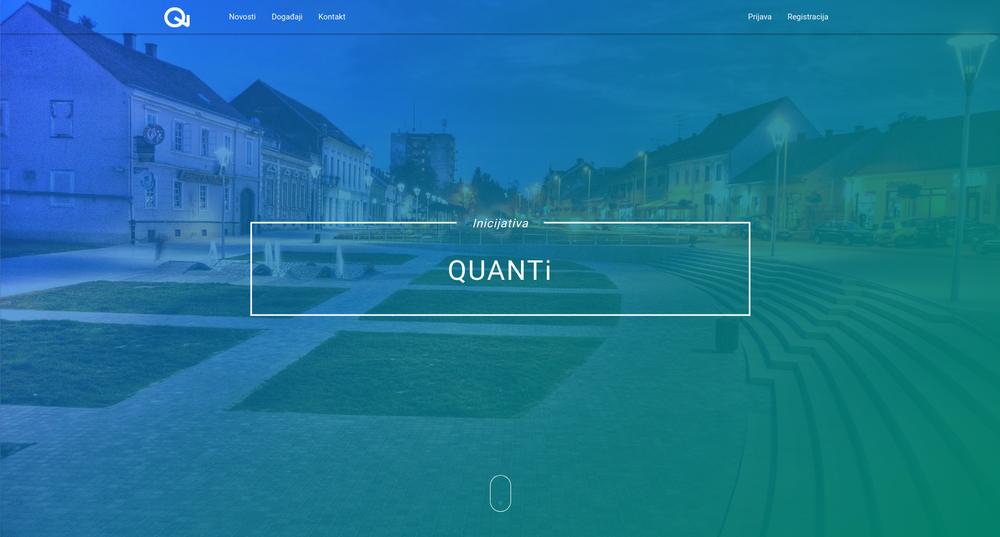
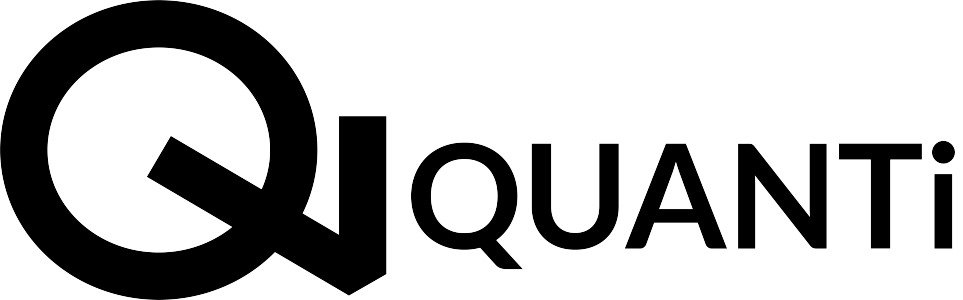

# QUANTi web

> A website for QUANTi community. [https://quanti.com.hr/](https://quanti.com.hr/)

----------
## Used technologies
* PHP
* SQL
* JavaScript
* HTML and CSS
 

* **Frameworks**
	* **[Laravel](https://laravel.com/)** - _The PHP Framework For Web Artisans_
	* **[Vue](https://vuejs.org/)** - _The Progressive JavaScript Framework_
	* **[Materialize](http://materializecss.com/)** - _Modern responsive CSS framework based on Material Design by Google_
 

* **Database**
	* **[MySQL](https://www.mysql.com/)** - _Open-source relational database management system (RDBMS)_
 

* **Other**
 	* **[jQuery](https://jquery.com/)** - _Fast, small, and feature-rich JavaScript library_
	* **[Voyager](https://laravelvoyager.com/)** - _Laravel Admin Package that includes BREAD (CRUD) operations_
	* **[LightSlider](http://sachinchoolur.github.io/lightslider/)** - _Lightweight responsive Content slider with carousel thumbnails navigation_
 	* **[Font Awesome](https://fontawesome.com/v4.7.0/)** - _The iconic font and CSS toolkit_

----------
**© Danijel Martinek** 

